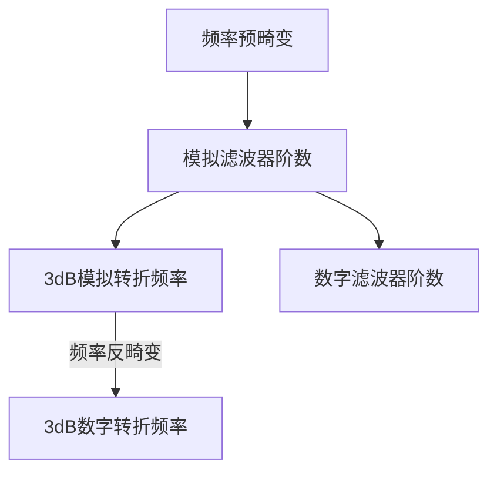
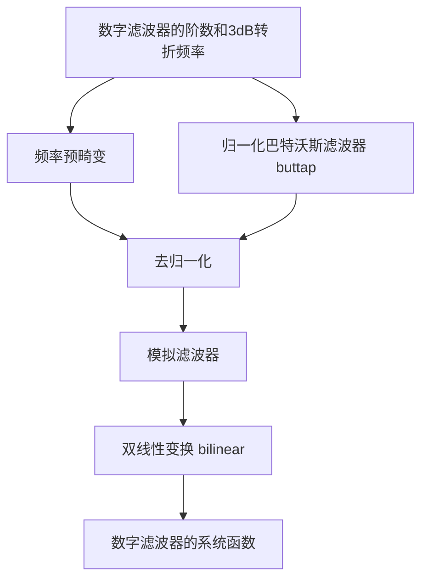
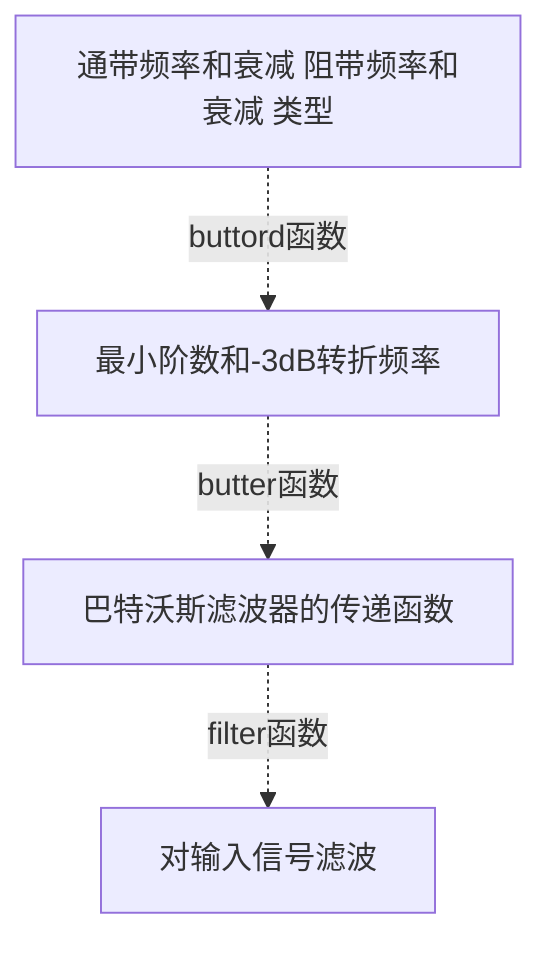
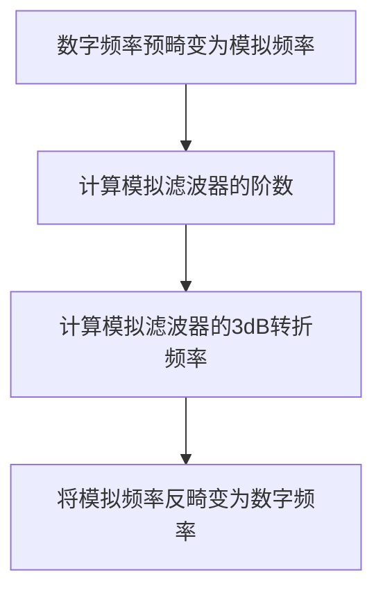
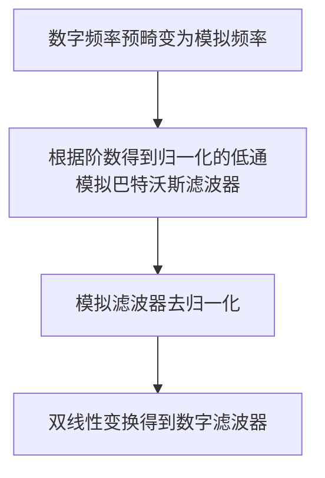
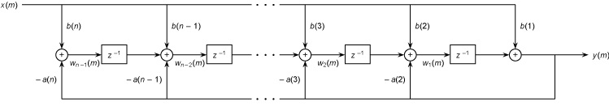
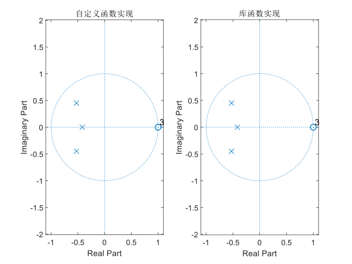
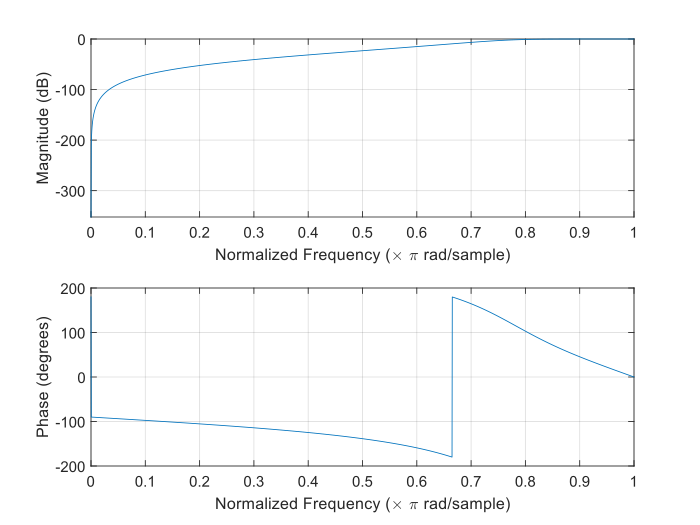
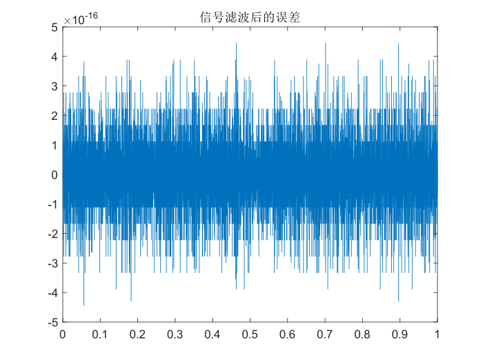
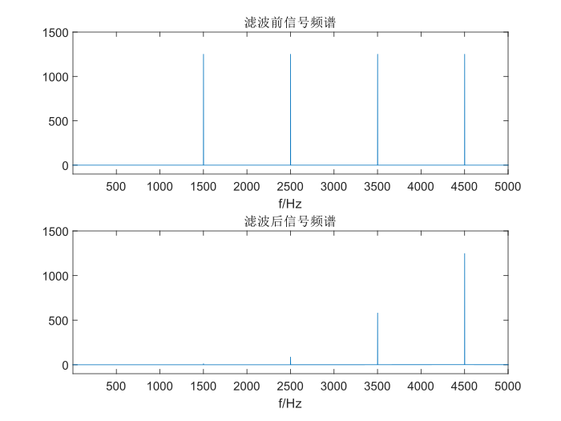

# 生物医学数字信号处理 滤波器学习笔记

> 工程科学学院 汪能志 U201713082

## 采样间隔对数字滤波器的影响

笔记图6-8，采样间隔取不同的值，模拟滤波器与数字滤波器之间的变化是什么？

根据模拟滤波器和冲激响应不变法计算数字滤波器的系统函数：

$$
H_a(s)=\frac{1}{s+1}-\frac{1}{s+3}=\frac{2}{s^2+4s+3} \\
H(z)=\frac{T(e^{-T}-e^{-3T})z^{-1}}{1-(e^{-T}+e^{-3T})z^{-1}+e^{-4T}z^{-2}}
$$

在不同的采样间隔下：


可见，随着采样间隔T的减小，数字滤波器在$ \omega=\pi $处的频率响应值减小，即发生混叠的程度减小。其原因主要是冲激响应不变法是对模拟滤波器的单位冲激响应进行周期采样的结果。由于单位冲激响应不是严格带限信号，因此会发生频谱混叠，且采样间隔越小，频谱混叠程度越低。

因此，在使用冲激响应不变法时，需要尽可能保证更大的阻带衰减和更小的采样间隔，这样才能尽可能减小频谱混叠。

<div STYLE="page-break-after: always;"></div>

## 冲激响应不变法和双线性变换法

论证冲激响应不变法及双线性变换法各自优势及不足。

### 冲激响应不变法

冲激响应不变法从单位冲激响应出发，目标是使数字滤波器的单位冲激响应$ h[n] $尽可能逼近模拟滤波器的单位冲激响应$ h(t) $，即$ h[n]=h_a(nT) $。

从拉普拉斯变换域（s平面）和z变换域（z平面）来看，冲激响应不变法的变换关系为$ z=e^{sT} $。

变换式为：

$$
H_a(s)=\sum_{k=1}^{N}\frac{A_k}{s-s_k} \Rightarrow H(z)=\sum_{k=1}^{N}\frac{A_k}{1-e^{s_kT}z^{-1}}
$$

这一变换满足频率轴对应和因果性不变的基本要求，同时在变换前后：

1. s平面的一阶极点$ s=s_k $变换为z平面的一阶极点$ z=e^{s_kT} $；

2. $ H(z) $和$ H_a(s) $的部分分式的系数相同；

3. s平面和z平面并不是一一对应的，例如在s平面上相距$ 2j\pi $的两个点，在变换后的z平面上就是一个点。

从时域的角度来看，可以认为冲激响应不变法的思路是**对模拟滤波器的单位冲激响应$ h(t) $以间隔$ T $进行采样，作为数字滤波器的单位冲激响应**。此时，对应的采样率为$ \Omega_s=\frac{2\pi}{T} $。根据奈奎斯特采样定理，模拟滤波器的单位冲激响应必须是截止频率不大于$ \Omega_h=\frac{\pi}{T} $的低通信号，否则就会出现频谱混叠的情况。

* 优势

    1. 频率线性变换

    冲激响应不变法中，在折叠频率内，模拟频率到数字频率是线性变换关系。因此带限于折叠频率内的滤波器的频率响应在变换后可以不失真地重现（幅度和相位）。

* 不足

    1. 混叠失真

        由于冲激响应不变法并不是一一对应的变换，数字滤波器的频率响应$ H(e^{j\omega}) $是模拟滤波器频率响应$ H(j\Omega) $的周期延拓，延拓周期为$ \Omega_s=\frac{2\pi}{T} $。因此可能出现混叠失真的情况。

    2. 严格带限

        只有在模拟滤波器严格带限于$ \frac{\Omega_s}{2}=\frac{\pi}{T} $，数字滤波器带限于$ \omega=\pi $时，才能避免混叠失真。

        因此冲激响应不变法只能用来设计低通滤波器，不能设计高通和带阻滤波器。

    3. 并联实现

        模拟滤波器必须可以以并联方式实现，即其系统函数必须能够展开为部分分式形式。在这种情况下才能将其变换为数字滤波器。
        
<div STYLE="page-break-after: always;"></div>

### 双线性变换法

双线性变换法得到的数字滤波器的频率响应和模拟滤波器的频率响应相似，其模拟频率$ \Omega $和数字频率$ \omega $是单值变换。

其映射关系为：

$$
s=\frac{2}{T}\cdot\frac{1-z^{-1}}{1+z^{-1}} \\ \Omega=\frac{2}{T}\tan{\frac{\omega}{2}}
$$

* 优势

    1. 适用于各种结构的系统函数表达式

        由于s平面和z平面之间有简单的代数变换式，因此模拟滤波器的系统函数都可以变换为数字滤波器的系统函数。

    2. 不存在频率混叠
       
        $ \Omega=\frac{2}{T}\tan{\frac{\omega}{2}} $不是一个线性变换。在$ \omega \rightarrow 0 $时，$\omega $和$ \Omega $近似成线性关系，在$ \Omega $继续增长时，$  \omega $的增长逐渐减慢，最终终止于折叠频率，因此一定不会出现频谱混叠。

    3. 可以设计多种滤波器（低通、高通、带通和带阻）

* 不足

    1. 频率畸变
       
        由于其频率变换不是线性变换，因此数字滤波器的频率响应相对于模拟滤波器一定会存在频率畸变。

    2. 频率预畸变和分段线性系统

        通过非线性变换$ \Omega_i=\frac{2}{T}\tan{\frac{\omega}{2}} $对模拟滤波器进行预畸变，这样再通过双线性变换法得到的数字滤波器的频率响应就和原始模拟滤波器的频率响应保持线性关系。

        主要用于分段常数型滤波器中，在经过双线性变换法变换后，得到的数字滤波器是临界频率发生非线性畸变的分段常数型滤波器。这时可以通过对临界频率点进行频率预畸来矫正频率畸变。

<div STYLE="page-break-after: always;"></div>

## MATLAB相关函数

### buttord函数

* 输入

    通带频率和衰减
    
    阻带频率和衰减

* 输出

    最低阶数和截止频率

* 实现思路



<div STYLE="page-break-after: always;"></div>

### butter函数

* 输入

    滤波器的阶数
    
    归一化截止频率
    
    滤波器类型（高通、低通、带通、带阻）

* 输出

    描述数字系统的方程（传递函数模型，零极点增益模型）

* 实现思路
  

<div STYLE="page-break-after: always;"></div>

### filter函数

* 输入

    传递函数模型
    
    输入信号x

* 输出

    输出信号y

* 实现思路

    MATLAB未提供源代码。
    
    [在线帮助文档](https://www.mathworks.com/help/matlab/ref/filter.html)中说明，可以使用` 差分方程 `或者` 直接II型IIR滤波器的转置结构 `实现。
    
### freqz函数

* 输入

    描述数字系统的方程（传递函数模型，零极点增益模型）

* 输出

    频率响应

<div STYLE="page-break-after: always;"></div>

## 自定义实现

### 滤波器的设计和工作流程



### 计算公式推导

#### 频率预畸变

需要注意在MATLAB中的数字频率为**归一化频率**，满足$ \omega=\frac{\Omega}{\pi\cdot fs} $。即其归一化频率为$ 1 rad/s $时，实际的数字频率为$ \pi rad/s $。

为了和MATLAB中的其他部分保持一致，之后的计算和程序采用MATLAB中的频率定义。

按照MATLAB的频率定义进行计算时，预畸变公式修正为：

$$
\Omega'=\frac{2}{T} \cdot \tan{\frac{\pi \omega}{2}}
$$

在MATLAB的库函数` buttord `中，取` T=1 `。

在MATLAB的库函数` butter `中，其可能使用了**错误的预畸变公式**！

```matlab
% step 1: get analog, pre-warped frequencies
if ~analog
    fs = 2;
    u = 2*fs*tan(pi*Wn/fs);
else
    u = Wn;
end
```

可见，其将` u = 2*fs*tan(pi*Wn/2); `错误写为了` u = 2*fs*tan(pi*Wn/fs); `。因此必须取` fs=2 `，才能得到正确的结果。

#### 去归一化

1. 低通-低通去归一化

由归一化原型滤波器的系统函数去归一化的方法为
$$
H_a(s)=H_{an}(\frac{s}{\Omega_c})
$$

2. 低通—高通去归一化

低通滤波器到高通滤波器的变换即为s变量的倒量变换，即$ s=\frac{1}{s} $

#### 双线性变换

模拟滤波器和数字滤波器的系统函数都可以表示为零极点增益形式：

$$
H(s)=k_s\cdot\frac{\prod_{i=1}^{M}{(s-s_{zi})}}{\prod_{i=1}^{N}{(s-s_{pi})}} \quad M \leq N
$$

$$
H(z)=k_z\cdot\frac{\prod_{i=1}^{M}{(z-z_{zi})}}{\prod_{i=1}^{N}{(z-z_{pi})}} \quad M\leq N
$$

在变换前后，s平面的极点$ s_{pi} $和z平面的极点$ z_{pi} $相互对应；s平面的零点$ s_{zi} $和z平面的零点$ z_{zi} $相互对应。因此只需要计算s平面的极零点和增益变换到z平面后的值，就可以得到数字滤波器的系统函数。

双线性变换公式为：

$$
s=\frac{2}{T}\cdot\frac{1-z^{-1}}{1+z^{-1}}
$$

因此，极点和零点的变换公式为：

$$
z=\frac{1+\frac{T}{2}\cdot s}{1-\frac{T}{2}\cdot s} \quad z=z_{zi},z_{pi} \quad s=s_{zi},s_{pi}
$$

增益的变换公式：

$$
k_z=k_s\cdot\frac{\prod{(\frac{2}{T}-z_{si})}}{\prod{(\frac{2}{T}-p_{si})}}
$$

$ z_{si} $中不包括位于$ \infty $处的零点

<div STYLE="page-break-after: always;"></div>

### 滤波器阶数和截止频率的计算



$$
N\geq\frac{\log{\frac{10^{0.1 \cdot R_s - 1}}{10^{0.1 \cdot R_p - 1}}}}{2\cdot\log{\frac{\Omega_s}{\Omega_p}}}
$$

$$
\Omega_c\geq\frac{\Omega_p}{\sqrt[2N]{10^{0.1 \cdot R_p - 1}}}=\Omega_{cp} \\
\Omega_c\leq\frac{\Omega_s}{\sqrt[2N]{10^{0.1 \cdot R_s - 1}}}=\Omega_{cs}
$$

在低通滤波器中，截止频率$ \Omega_c $直接取$ \Omega_{cs} $，这时可以获得更大的阻带衰减。

```MATLAB
function [order, wc] = my_buttord(wp, ws, Rp, Rs)
% in MATLAB $ w = W / (pi * Fs) $ not $ w = W / Fs $ in textbook
T = 2;

% D-A, pre-warped frequencies
Wp = (2 / T) .* tan(pi .* wp ./ 2);
Ws = (2 / T) .* tan(pi .* ws ./ 2);
G = (10^(0.1 * Rs) - 1) / (10^(0.1 * Rp) - 1);

if Wp < Ws
    % low pass
    Wa = Ws / Wp;
elseif Wp > Ws
    % high pass
    Wa = Wp / Ws;
end

% min order
order = ceil(log(G) / (2 * log(Wa)));
% cutoff frequency
Wp0 = Wa / ((10^(0.1 * Rp) - 1)^(1 / (2 * order)));
Ws0 = Wa / ((10^(0.1 * Rs) - 1)^(1 / (2 * order)));

if Wp < Ws
    Wc = Wp * Ws0;
elseif Wp > Ws
    Wc = Wp / Ws0;
end

% A-D, anti-warped frequencies
wc = (2 / pi) .* atan(T .* Wc ./ 2);
end
```

### 数字巴特沃斯滤波器的实现



以下实现了低通巴特沃斯滤波器和高通巴特沃斯滤波器，带通和带阻滤波器尚未实现。

```MATLAB
function [bz, az] = my_butter(N, wc, type)
%%
% pre-warped frequencies
T = 2;
Wc = (2 / T) .* tan(pi .* wc ./ 2);

%%
% AF system of butter prototype, with a cutoff frequency at 1 rad/s

% [zn, pn, kn] Zeros-Poles-Gain
% [bn, an] Transfer Function

zn = inf .* ones(N, 1);
pn = zeros(N, 1);
kn = 1;
num = 1;

for i = 1:2 * N
    if mod(N, 2) == 0
        P = exp(1j * pi * (i - 0.5) / N);
    elseif mod(N, 2) == 1
        P = exp(1j * pi * i / N);
    end
    if real(P) < 0
        % all poles should in the left half plane
        pn(num) = P;
        num = num + 1;
    end
end

bn = kn .* poly(zn);
an = poly(pn);

%%
% cutoff frequency transformation, 1 rad/s to Wc rad/s
% [zs, ps, ka] Zeros-Poles-Gain
% [bs, as] Transfer Function
if type == 'lp'
    % low pass to low pass
    zs = zn;
    ps = Wc .* pn;
    ks = kn .* (Wc^N);
elseif type == 'hp'
    % low pass to high pass
    zs = 1 ./ zn;
    ps = Wc ./ pn;
    ks = 1;
end

bs = ks .* poly(zs);
as = poly(ps);

%%
% Bilinear transformation
% [zz, pz, kz] Zeros-Poles-Gain
% [bz, az] Transfer Function
zs = zs(isfinite(zs));
zz = (1 + zs * (T / 2)) ./ (1 - zs * (T / 2));
pz = (1 + ps * (T / 2)) ./ (1 - ps * (T / 2));
kz = (ks * prod((2 / T) - zs)) ./ prod((2 / T) - ps);

Z = -ones(size(pz));

for i = 1:numel(zz)
    Z(i) = zz(i);
end

zz = Z;

az = poly(pz);
bz = kz .* poly(zz);
az = real(az);
bz = real(bz);
end
```

<div STYLE="page-break-after: always;"></div>

### 计算系统输出

#### 系统结构

MATLAB中并未提供`filter`函数的源码，这里的实现参考了数字信号处理教程和MATLAB的帮助文档中说明的方法，使用直接II型IIR滤波器的转置结构实现。



#### MATLAB实现

```MATLAB
function y = my_filter(b, a, x)
% Direct Form II Transposed
% x input
% y output
% u buffer
order = max(numel(a), numel(b)) - 1;

a = a ./ a(1);
b = b ./ a(1);
a(1) = [];
y = zeros(size(x));
u = zeros(1, order);

for i = 1:length(x)
    y(i) = b(1) * x(i) + u(1);
    u = [u(2:order), 0] + b(2:end) * x(i) - a * y(i);
end

end
```

### 绘制频率响应曲线

计算$ H(e^{j\omega}) $在$ \omega $取$ 1 $到$ \pi $的值。并绘制增益和相移的曲线。

```MATLAB
function my_freqz(bz, az)
% TF-DF to ZPK-DF
zz = roots(bz);
pz = roots(az);
bz_not_0 = bz(bz ~= 0);
kz = bz_not_0(1) / az(1);
% [zz, pz, kz] = tf2zpk(bz, az);

L = 2048;
w = linspace(0, 1, L);
Y = zeros(1, L);
% calculate frequenct response
for i = 1:L
    wi = w(i);
    A = prod(exp(1j * pi * wi) - zz);
    B = prod(exp(1j * pi * wi) - pz);
    Y(i) = kz * A / B;
end

% Magnitude and Phase
Y_dB = 20 * log10(abs(Y));
Y_phase = rad2deg(angle(Y));

min_dB = min(Y_dB);
max_dB = max(max(Y_dB), 0);

subplot(2, 1, 1)
plot(w, Y_dB)
grid on
xlabel('Normalized Frequency (\times \pi rad/sample)')
ylabel('Magnitude (dB)')
xlim([0, 1])
ylim([min_dB, max_dB])
subplot(2, 1, 2)
plot(w, Y_phase)
grid on
xlabel('Normalized Frequency (\times \pi rad/sample)')
ylabel('Phase (degrees)')
xlim([0, 1])
end
```

<div STYLE="page-break-after: always;"></div>

### 测试

#### 低通滤波器

* 测试内容

    参考课件第54页的例题，使用双线性变换计算生成低通滤波器，并进行测试。

* 测试程序

```MATLAB
Rp = 1;
Wp = 2 * pi * 1000;

% stop
Rs = 15;
Ws = 2 * pi * 1500;
Fs = 10000;
wp = Wp / (pi * Fs);
ws = Ws / (pi * Fs);

[N, wc] = my_buttord(wp, ws, Rp, Rs);
[N2, wc2] = buttord(wp, ws, Rp, Rs);

[b1, a1] = my_butter(N, wc, 'lp');
[b2, a2] = butter(N2, wc2, 'low');

figure(1)
subplot(1, 2, 1)
zplane(b1, a1)
title('自定义函数实现')
subplot(1, 2, 2)
zplane(b2, a2)
title('库函数实现')

figure(2)
my_freqz(b1, a1)

%%
% Test signal
t = (1:1:10000) / Fs;

f = [750, 1250, 1750, 3500];
x = (sin(2 * pi * f(1) * t) + cos(2 * pi * f(2) * t) + sin(2 * pi * f(3) * t) + cos(2 * pi * f(4) * t)) ./ 4;
y1 = my_filter(b1, a1, x);
y2 = filter(b2, a2, x);

y_err = y1 - y2;
figure(3)
plot(t, y_err)
title('信号滤波后的误差')

X = abs((fft(x)));
Y = abs((fft(y1)));
freq = 1:Fs;

figure(4)
subplot(2, 1, 1)
plot(freq, X)
xlim([1 Fs / 2])
ylim([-100, 1500])
xlabel('f/Hz')
title('滤波前信号频谱')
subplot(2, 1, 2)
plot(freq, Y)
xlim([1 Fs / 2])
ylim([-100, 1500])
xlabel('f/Hz')
title('滤波后信号频谱')
```

<div STYLE="page-break-after: always;"></div>

* 测试结果

    1. 系统的零极点分布

    

    2. 系统的频率响应特性

    

    <div STYLE="page-break-after: always;"></div>

    3. 滤波器函数的结果对比

    

    4. 滤波前后信号对比（低通）

    

<div STYLE="page-break-after: always;"></div>

#### 高通滤波器

* 测试内容

$$
f_p=4000Hz \quad f_s=3000Hz  \quad R_p<1dB \quad R_s>15dB \quad Fs=10kHz
$$

* 测试程序

```MATLAB
Rp = 1;
Wp = 2 * pi * 4000;

% stop
Rs = 15;
Ws = 2 * pi * 3000;
Fs = 10000;
wp = Wp / (pi * Fs);
ws = Ws / (pi * Fs);

[N, wc] = my_buttord(wp, ws, Rp, Rs);
[N2, wc2] = buttord(wp, ws, Rp, Rs);

[b1, a1] = my_butter(N, wc, 'hp');
[b2, a2] = butter(N2, wc2, 'high');

figure(1)
subplot(1, 2, 1)
zplane(b1, a1)
title('自定义函数实现')
subplot(1, 2, 2)
zplane(b2, a2)
title('库函数实现')

figure(2)
my_freqz(b1, a1)

%%
% Test signal
t = (1:1:10000) / Fs;

f = [1500, 2500, 3500, 4500];
x = (sin(2 * pi * f(1) * t) + cos(2 * pi * f(2) * t) + sin(2 * pi * f(3) * t) + cos(2 * pi * f(4) * t)) ./ 4;
y1 = my_filter(b1, a1, x);
y2 = filter(b2, a2, x);

y_err = y1 - y2;
figure(3)
plot(t, y_err)
title('信号滤波后的误差')

X = abs((fft(x)));
Y = abs((fft(y2)));
freq = 1:Fs;

figure(4)
subplot(2, 1, 1)
plot(freq, X)
xlim([1 Fs / 2])
ylim([-100, 1500])
xlabel('f/Hz')
title('滤波前信号频谱')
subplot(2, 1, 2)
plot(freq, Y)
xlim([1 Fs / 2])
ylim([-100, 1500])
xlabel('f/Hz')
title('滤波后信号频谱')
```

<div STYLE="page-break-after: always;"></div>

* 测试结果

    1. 系统的零极点分布

    

    2. 系统的频率响应特性

    

    <div STYLE="page-break-after: always;"></div>

    3. 滤波器函数的结果对比

    

    4. 滤波前后信号对比（低通）

    

<div STYLE="page-break-after: always;"></div>

## 学习总结

本次的主要内容是模拟滤波器和数字滤波器的转换。使用的方法有冲激响应不变法和双线性变换法。在学习和实验过程中，顺着冲激响应不变法和双线性变换法的主要思路，我也在其中对之前学习过的线性时不变系统、采样定理等内容有了一定的复习。最后学习并重现MATLAB中有关巴特沃斯滤波器的内容较为复杂，在实现过程中除了MATLAB的库函数源代码和数字信号处理教材，还参考了Stack Overflow论坛中的一些内容。实现过程中，主要是针对MATLAB库函数中的计算流程，将其调用的函数逐步替换为自己推导并编写的计算方法，最后得到结果。MATLAB对于数字频率的定义和课本略有出入，在一开始我并没有发现这个问题，这在实验中导致了一些麻烦。另一点就是MATLAB的部分代码可能存在一些问题，在学习时不能盲信。
